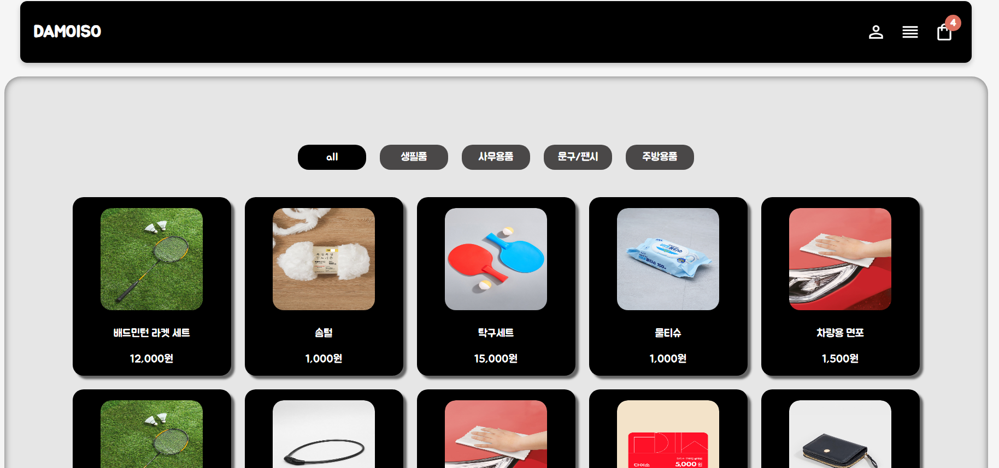
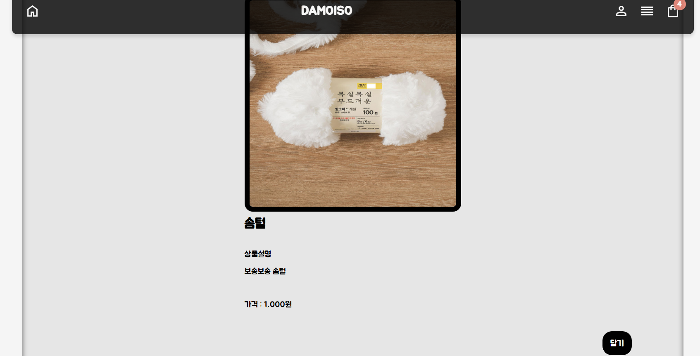
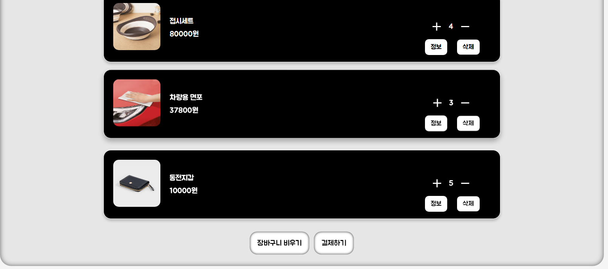
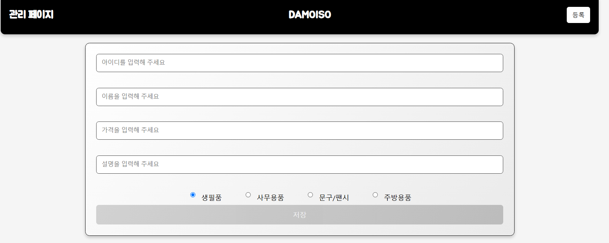
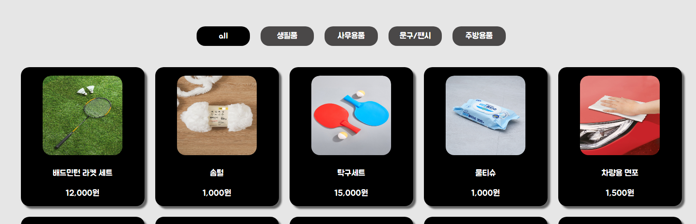
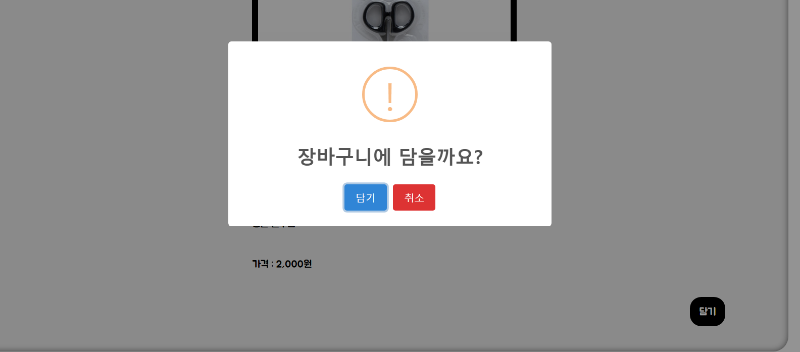
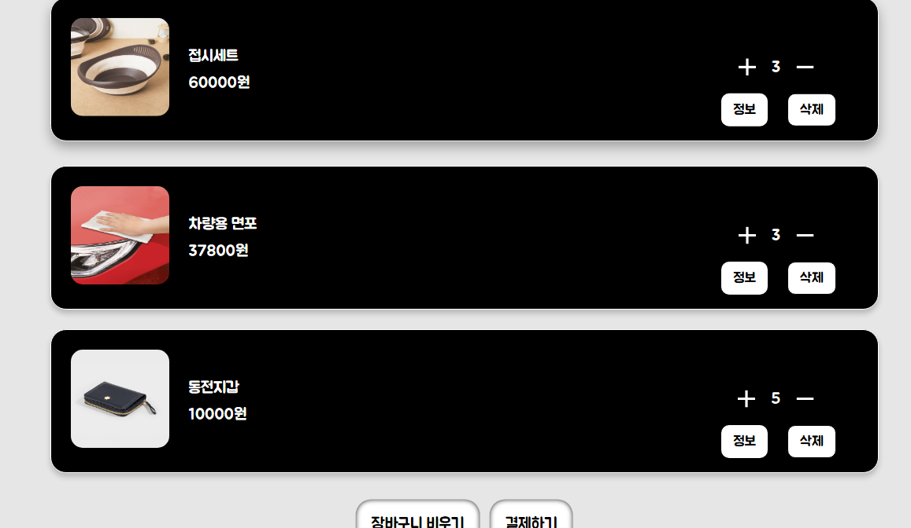
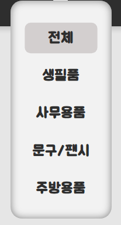
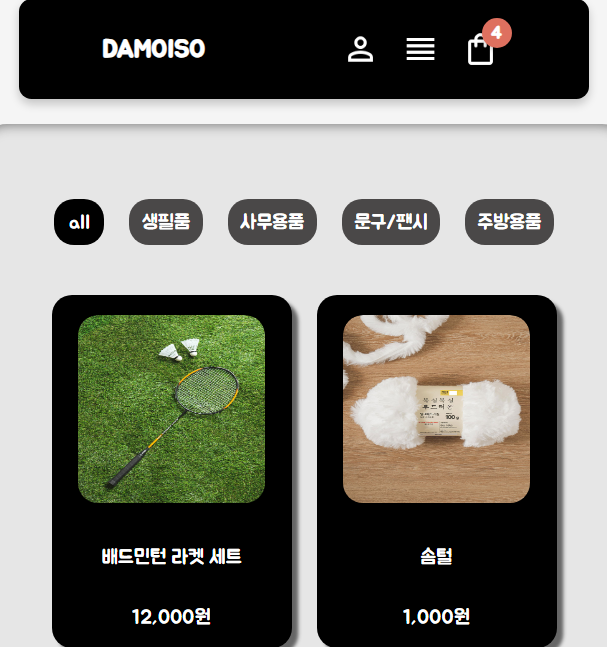

### 아이템 등록 후 아이템 게시 홈페이지

#### 페이지별 정리

메인 페이지

상세 페이지

장바구니

관리 페이지

#### 기능

관리 페이지에서 카테고리에 따라 아이템 등록 카테고리 별로 정리 (카테고리 명은 코드 내에서 변경 가능)

게시물 등록

물품을 장바구니에 담고 (로컬 스트리지 사용) 해당 물품에 갯수 조절도 가능

카테고리 별로 드롭다운 메뉴가 만들어지며 해당하는 카테고리가 메인 페이지에도 버튼이 같이 생성됨

뷰포인트 픽셀이 줄어들면 크기에 따라 요소 크기 조절

#### 외부 라이브러리

