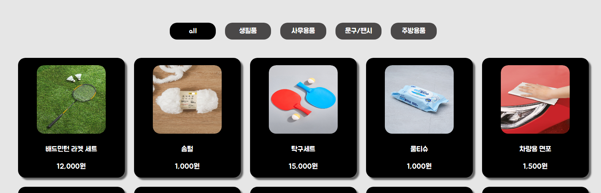
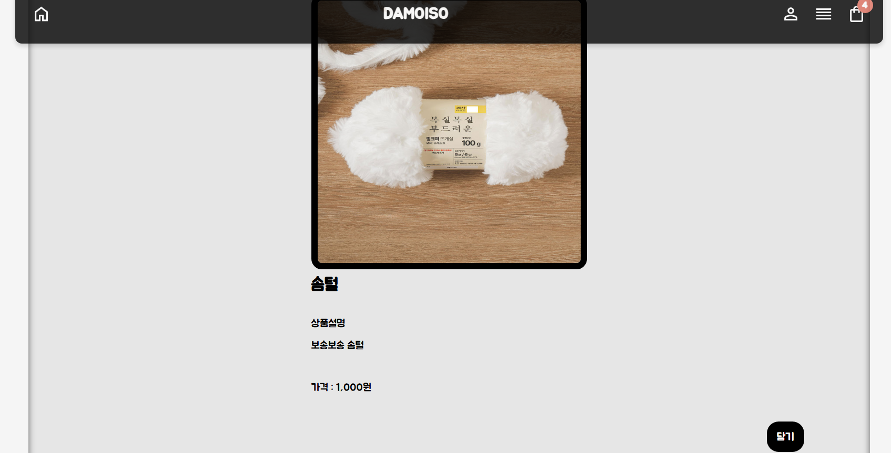
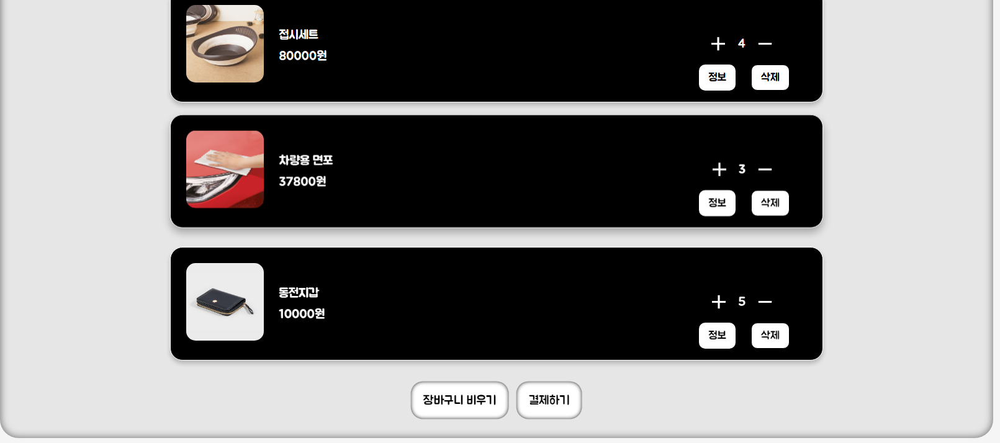
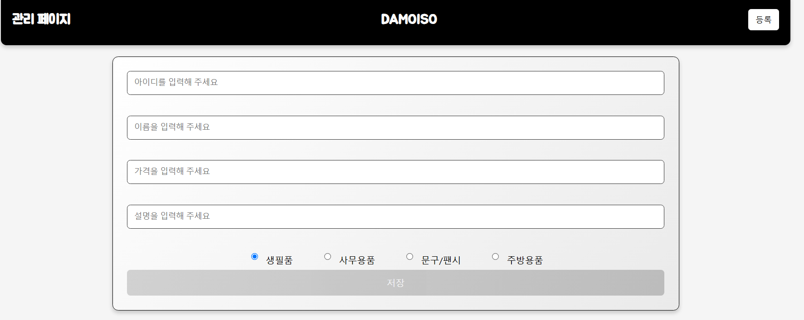
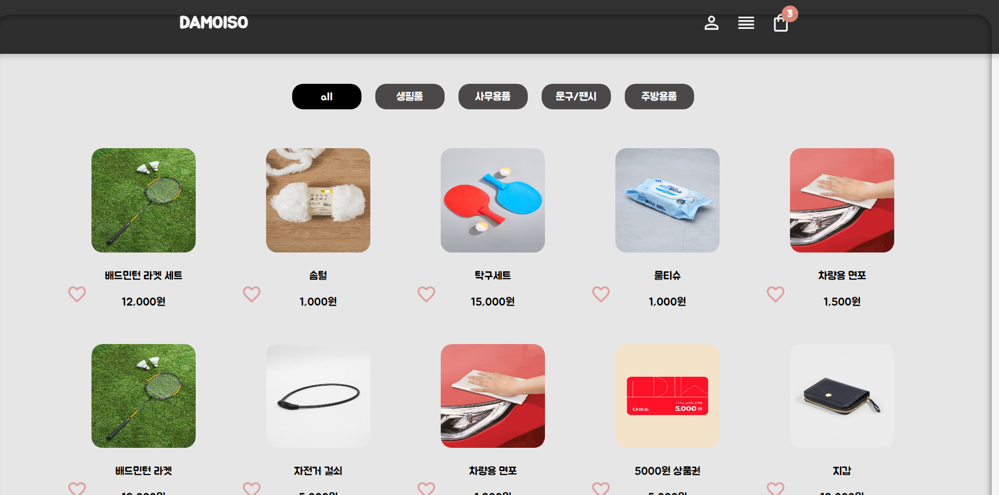
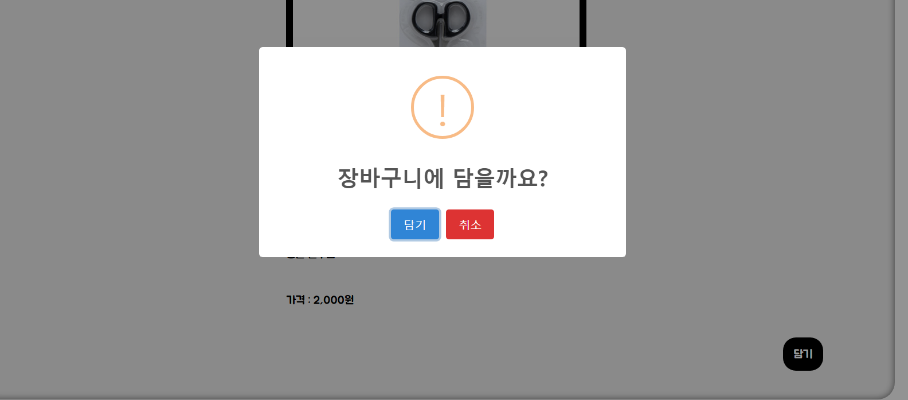
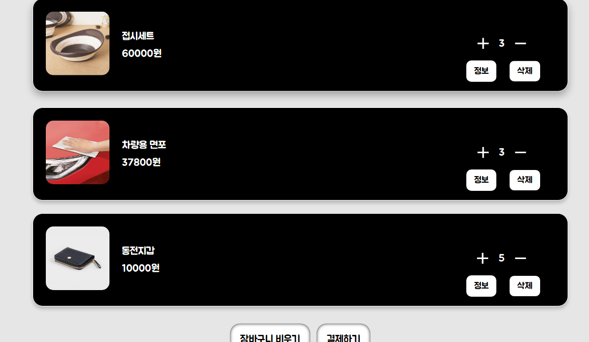
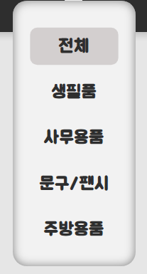
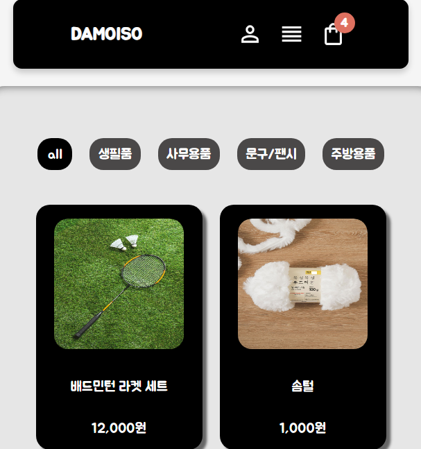

### 아이템 등록 후 아이템 게시 홈페이지

 

#### 페이지별 정리

 

#### 메인 페이지

#### 상세 페이지

#### 장바구니

#### 관리 페이지

### **기능**

  

#### 관리 페이지에서 카테고리에 따라 아이템 등록 카테고리 별로 정리 (카테고리 명은 코드 내에서 변경 가능)

  

#### 게시물 등록

  

#### 물품을 장바구니에 담고 (로컬 스트리지 사용) 해당 물품에 갯수 조절도 가능 로컬 스트리지 안에 데이터 수량도 같이 줄어들게끔

  

#### 카테고리 별로 드롭다운 메뉴가 만들어지며 해당하는 카테고리가 메인 페이지에도 버튼이 같이 생성됨

  

#### 뷰포인트 픽셀이 줄어들면 크기에 따라 요소 크기 조절

  

#### 외부 라이브러리

https://sweetalert2.github.io/
